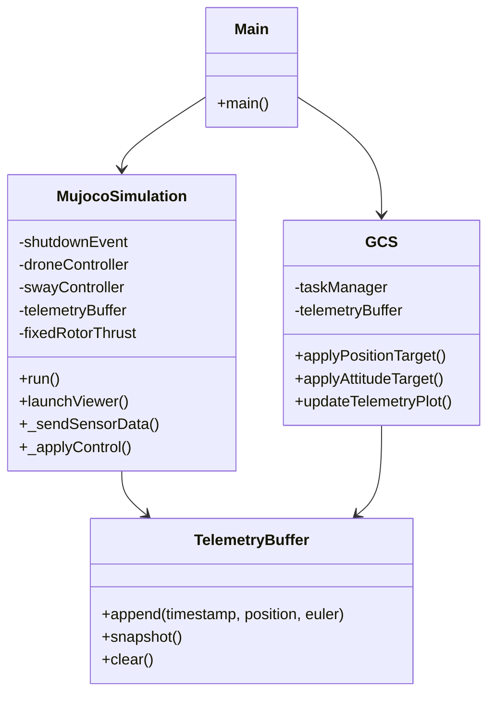
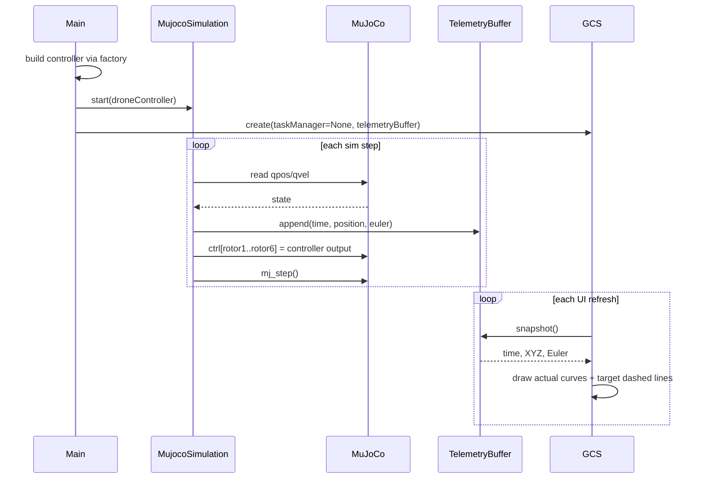
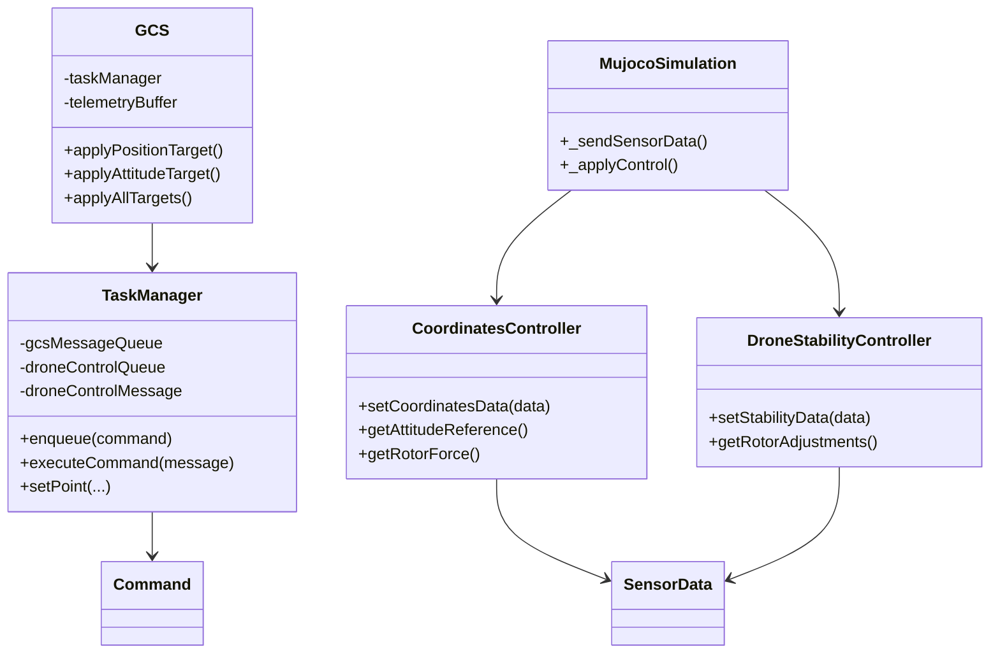
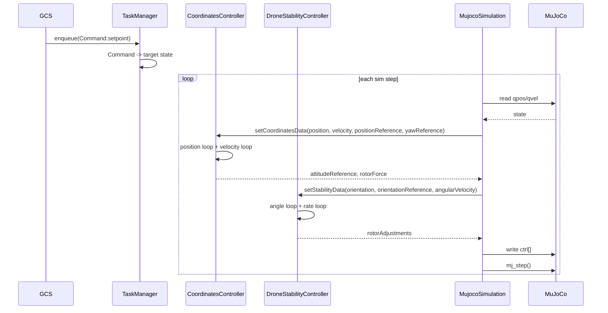

# Architecture

This document summarizes the current code structure and the main runtime call paths.
It separates the system into two views:

- the current runtime path that is actually active in `Main.py`
- the full closed-loop design path that already exists in code but is not currently wired into `Main.py`

## Current Runtime Path

The current entry point is [Main.py](C:/Users/wangh/Desktop/Simulation/Main.py:1).
At the moment, it builds a multirotor controller through a controller factory, starts MuJoCo with that controller, and opens the ground control station in telemetry-only mode.

### Class Diagram



### Sequence Diagram



### Notes

- `GCS` is currently created with `taskManager=None`, so it does not send control commands to the vehicle.
- The left-side target inputs in the UI only affect the plotted reference lines in this mode.
- The actual control applied to the vehicle comes from the injected multirotor controller instance.

## Legacy Closed-Loop Design Path

The project still contains legacy position and attitude controller modules under `src/drone/droneControllers/`.
They are not part of the current `Main.py` runtime path, which now uses only `DroneControllerInterface`.

### Class Diagram



### Sequence Diagram



### Legacy Control Composition

In the legacy cascaded design, the nested controllers are combined as:

```text
u_i = base_thrust + rotor_adjustments[i]
```

where:

- `base_thrust` comes from `CoordinatesController.getRotorForce()`
- `rotor_adjustments` comes from `DroneStabilityController.getRotorAdjustments()`

This means:

- the outer position loop generates a collective thrust level and an attitude reference
- the inner attitude loop converts the attitude tracking error into per-rotor differential inputs

## Message and Data Flow

The main data objects live in [include/Messages.py](C:/Users/wangh/Desktop/Simulation/include/Messages.py:1):

- `Command`: high-level UI command from `GCS` to `TaskManager`
- `ControlMessage`: legacy target state previously used by the old cascaded controller path
- `SensorData`: vehicle feedback sent from `MujocoSimulation` to the active controller
- `ControlAction`: legacy actuator-command container used by the old cascaded controller path

You can think of them as four layers:

```text
UI command layer:     Command
control target layer: ControlMessage
feedback layer:       SensorData
actuator layer:       ControlAction
```

## Summary

The currently active runtime chain is:

```text
Main -> controller factory -> DroneControllerInterface
Main -> MujocoSimulation -> MuJoCo
Main -> GCS -> TelemetryBuffer
```

The legacy cascaded closed-loop chain is:

```text
GCS -> TaskManager
TaskManager -> CoordinatesController / DroneStabilityController
CoordinatesController / DroneStabilityController -> MujocoSimulation -> MuJoCo
MuJoCo -> MujocoSimulation -> SensorData -> controller modules
```
