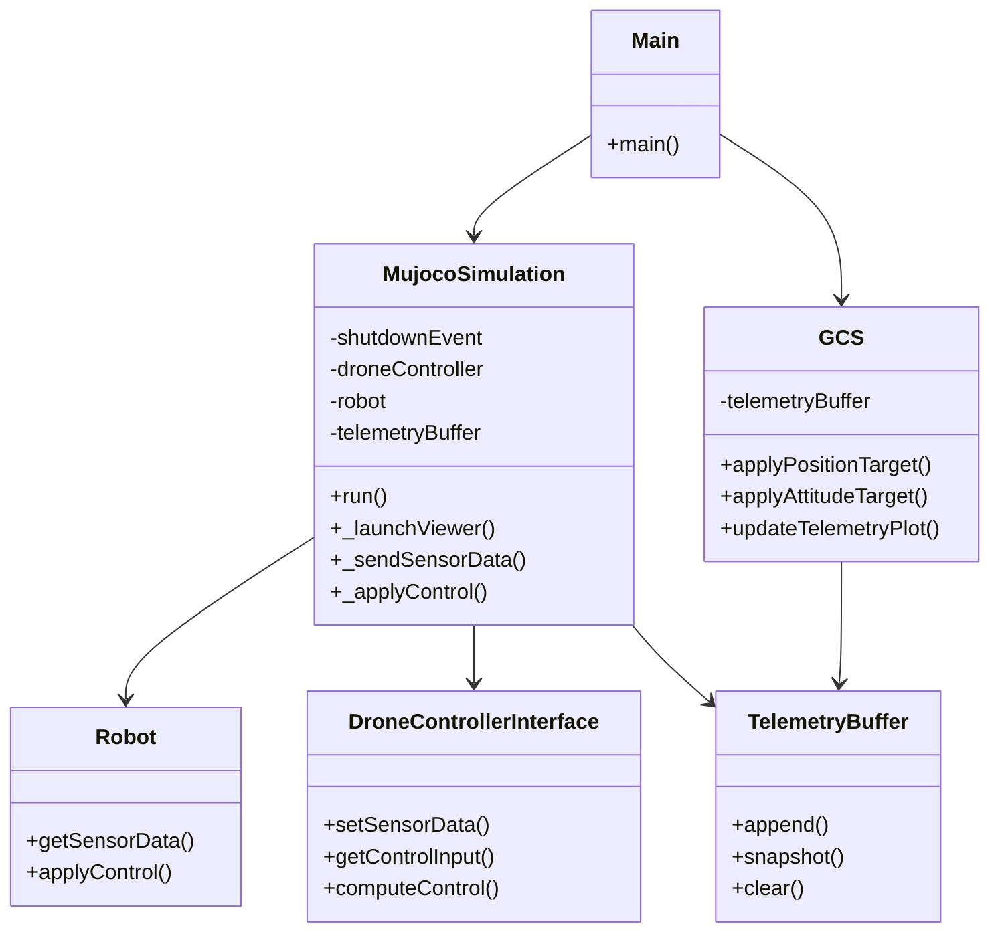
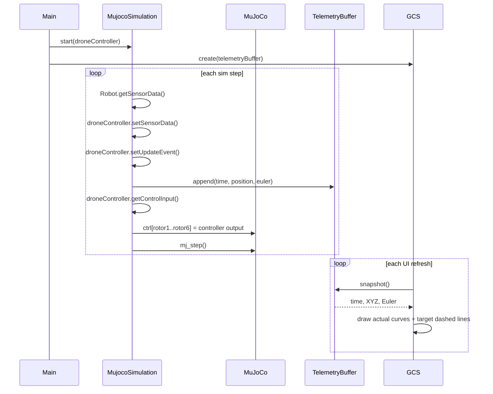

# Architecture

This document summarizes the current code structure and runtime call paths.

## Runtime Call Path

The entry point is `Main.py`. It builds a drone controller, starts the MuJoCo simulation thread, and opens the ground control station.

### Class Diagram



### Sequence Diagram



### Notes

- `GCS` is created with `taskManager=None`, so it does not send control commands to the vehicle.
- The left-side target inputs in the UI only affect the plotted reference lines.
- The actual control applied to the vehicle comes from the injected `DroneControllerInterface` instance.

## Summary

The active runtime chain is:

```text
Main -> controller factory -> DroneControllerInterface
Main -> MujocoSimulation -> Robot <-> MuJoCo
Main -> GCS -> TelemetryBuffer
```
